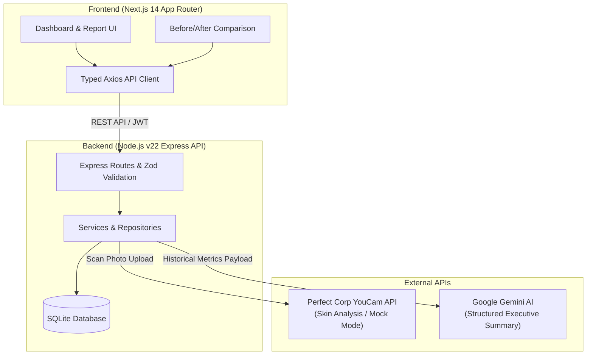

<h1>
  
  Skin Journey
</h1>
An objective, metric-grounded skincare progress platform built for the YouCam API Hackathon.

Skin Journey transforms raw skin analysis into a long-term progress journal. Every scan is stored permanently, tracked over time, compared before/after, and exportable as a dermatologist-ready PDF. Every score and chart comes directly from stored measurements or user journal entries — never guessed or estimated.

---

## ⚡ Quick Start

### Prerequisites & Requirements

- **Node.js**: **v22** (Recommended, Node >= 20 supported)
  ```bash
  # Switch to Node.js 22 using NVM (Node Version Manager)
  nvm install 22
  nvm use 22
  ```
- **Package Manager**: `npm`
- **API Keys & Authentication**:
  - **YouCam API Key** _(Required for live skin analysis)_:
    - **If available**: Set `YOUCAM_API_KEY=your_key` and `YOUCAM_MOCK_MODE=false` in `backend/.env` to analyze scans via the live Perfect Corp API.
    - **If NOT available**: Keep `YOUCAM_MOCK_MODE=true` (default). The app uses a deterministic mock engine to generate scan metrics derived from image hashes, allowing you to fully test scans, timeline, comparison, journal, and PDF exports without a live key.
  - **Google Gemini API Key** _(Optional)_:
    - Used exclusively for generating the executive AI Progress Summary on the Report page. If omitted, the rest of the application functions normally.

---

### 1. Start the Backend API

```bash
cd backend
nvm use 22
cp .env.example .env
npm install
npm run dev
```

> The API starts on `http://localhost:4000`. SQLite database is created and migrated automatically on first boot.

### 2. Start the Frontend Application

In a separate terminal window:

```bash
cd frontend
nvm use 22
cp .env.example .env.local
npm install
npm run dev
```

> The web application starts on `http://localhost:3000`.

---

## 🏗 System Architecture



---

## ✨ Features Overview

- 📸 **Guided Scan Capture**: Consistent photo capture guidance analyzed via Perfect Corp YouCam API (or deterministic Mock Mode).
- 📊 **Interactive Dashboard & Timeline**: Multi-metric tracking charts (Acne, Moisture, Texture, Radiance, etc.) plotted alongside life context milestones.
- 🔄 **Before & After Comparison**: Metric-by-metric comparison engine that dynamically evaluates improvements and regressions.
- 🤖 **AI Executive Takeaway**: Concise, high-impact progress summary powered by Google Gemini, grounded strictly in stored scan measurements.
- 📄 **Dermatologist PDF Export**: Complete exportable report with photo overlays, scan history, metrics, journal notes, and AI insights.
- 📓 **Journal & Milestones**: Track daily skincare products, routines, sleep, water intake, and lifestyle milestones.

---

## 🔧 Environment Configuration

### Backend (`backend/.env`)

| Variable           | Default                  | Description                                         |
| ------------------ | ------------------------ | --------------------------------------------------- |
| `PORT`             | `4000`                   | Server listening port                               |
| `DATABASE_PATH`    | `./data/skin_journey.db` | SQLite database file location                       |
| `JWT_SECRET`       | `super-secret-key...`    | Secret key for JWT auth signing                     |
| `YOUCAM_MOCK_MODE` | `true`                   | Set to `false` when connecting live YouCam API keys |
| `YOUCAM_API_KEY`   | `""`                     | Perfect Corp YouCam API Key                         |
| `GEMINI_API_KEY`   | `""`                     | Google Gemini API Key for AI summary generation     |
| `GEMINI_MODEL`     | `gemini-1.5-flash`       | Gemini AI model version                             |

### Frontend (`frontend/.env.local`)

| Variable                     | Default                 | Description                |
| ---------------------------- | ----------------------- | -------------------------- |
| `NEXT_PUBLIC_API_BASE_URL`   | `http://localhost:4000` | Backend API URL            |
| `NEXT_PUBLIC_API_TIMEOUT_MS` | `15000`                 | Frontend API timeout in ms |

---

## 💡 Mock Mode vs Live YouCam API

The repository defaults to `YOUCAM_MOCK_MODE=true`, which derives deterministic mock metric scores from the uploaded image hash. This allows full testing of scans, dashboard, comparison, journal, and PDF generation without an active YouCam subscription.

To switch to live API scoring:

1. Update `YOUCAM_API_KEY` in `backend/.env` with your key from the Perfect Corp Developer Console.
2. Set `YOUCAM_MOCK_MODE=false`.

---

## 📄 License

This project is licensed under the MIT License - see the [LICENSE](LICENSE) file for details.
